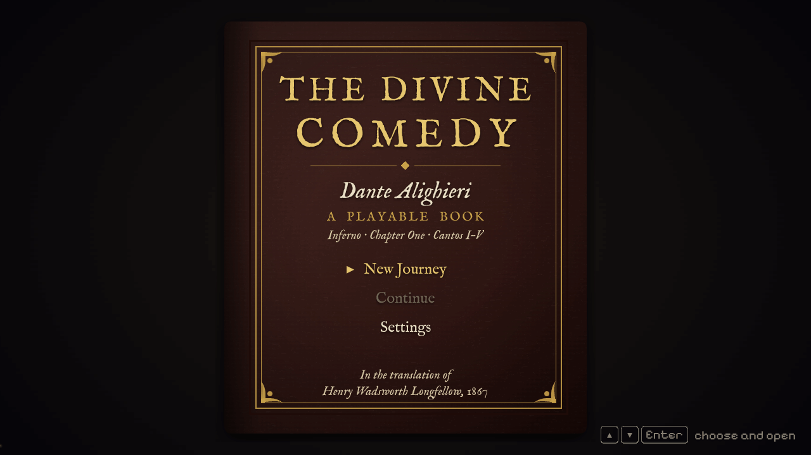
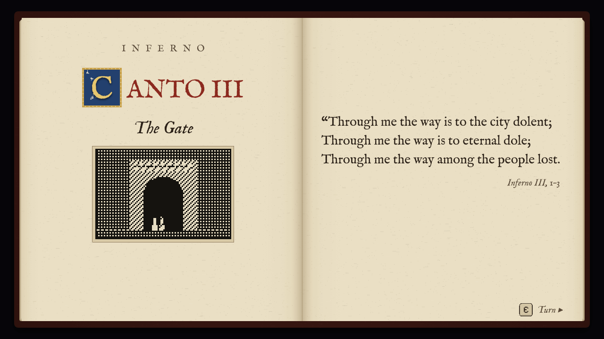
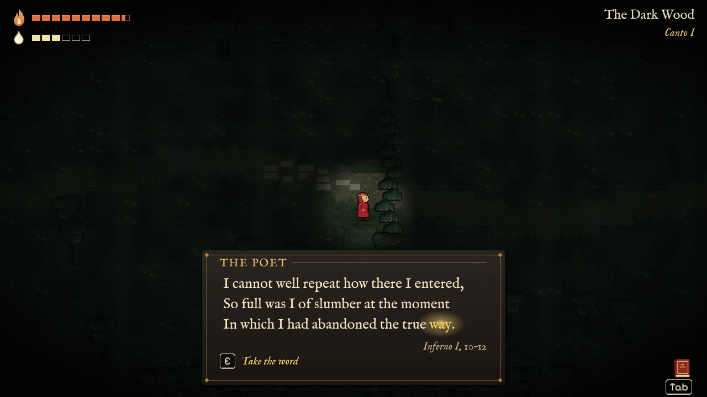
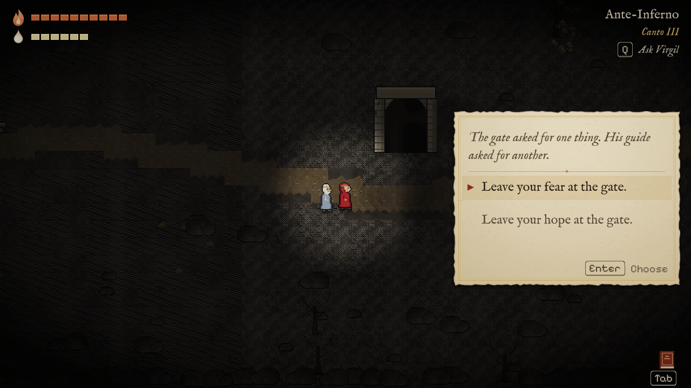
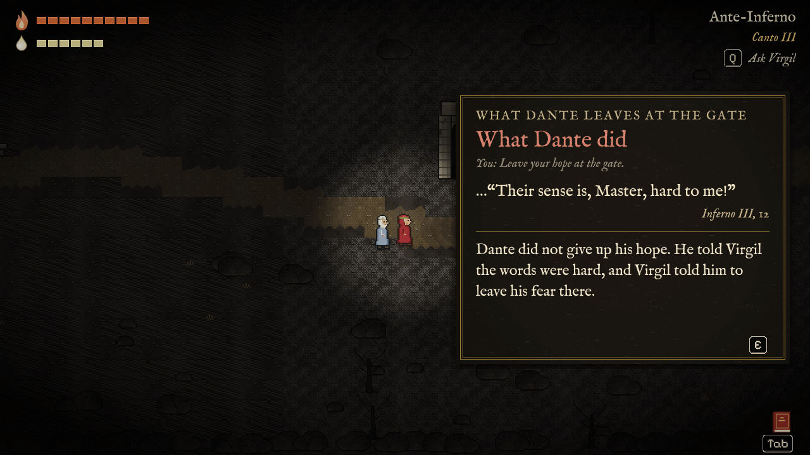
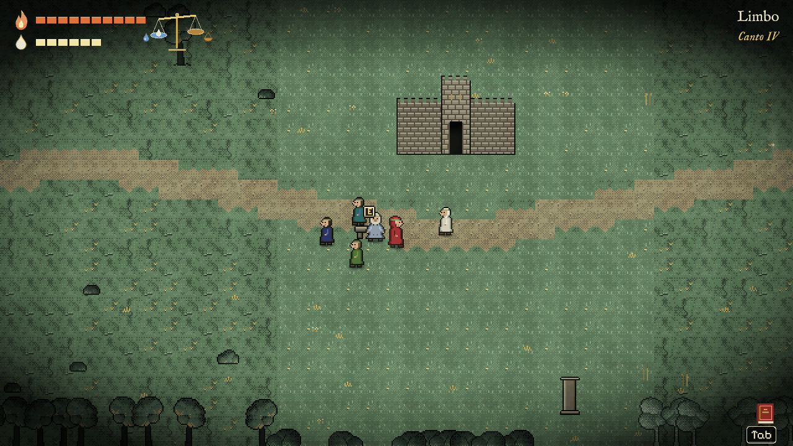
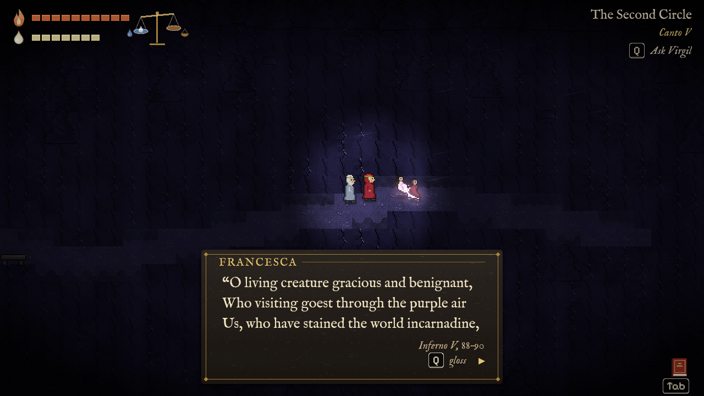
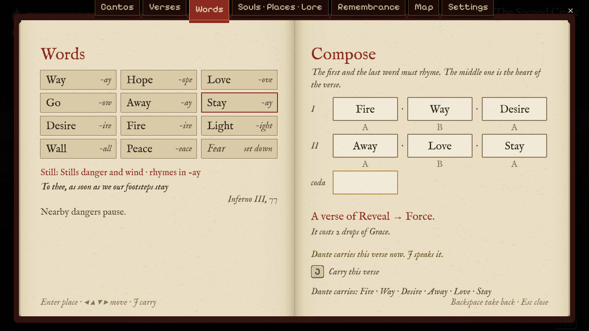

# The Divine Comedy — A Playable Book

Dante's *Inferno* as a book you read, play and change, in Henry Wadsworth Longfellow's 1867 translation.

The first generation of the book was plain text. The second was the illustrated book, the third the comic. This project tries a fourth: a **playable book**. You read it, you walk through it as Dante, and what you choose changes him. The route stays Dante's: he still meets the three beasts, still crosses the Acheron, still faints after Francesca. What you decide is how he answers what he sees, what he says, which words of the poem he keeps, and what he remembers. After every meaningful choice the book shows you what Dante did in the poem, in Longfellow's own lines.

It runs in the browser (Phaser 3, TypeScript, Vite). All in-game text is English. Every line of the poem is quoted word for word from Longfellow and always carries its citation; everything else (narration, dialogue, notes) is our own plain English and never pretends to be Dante's.

## Chapter 1: Inferno I–V

The first chapter is complete and playable from start to end. It is written for about an hour of reading and play.

| Canto | Title | What happens |
|---|---|---|
| I | The Dark Wood | Dante wakes lost in the dark wood, with fear in every hollow. The first words of the poem are collected here. The panther, the lion and the she-wolf bar the hill, and Virgil appears where the sun is silent. |
| II | The Evening of Doubt | Night falls and Dante doubts: he is no Aeneas, no Paul. Virgil tells how Beatrice came down to him, in illustrated pages. Dante composes his first tercet, *Way · Love · Away*, and it opens the way down. |
| III | The Gate | The words over the gate. You choose what Dante leaves there: his fear, as Virgil asks, or his hope, as the gate asks. The neutrals run behind their banner, Charon refuses a living man, the earth quakes, and Dante faints. |
| IV | Limbo | Sighs without torment. Virgil's own place among the unbaptized, the four great poets who make Dante the sixth, the noble castle, the meadow of the great spirits. Tercets now link into chains. |
| V | The Infernal Hurricane | Minos's court, where you can guess where each soul is sent. The hurricane that never rests, the shades who died for love, Francesca and Paolo, and the verdict at the centre of the chapter. Dante falls as a dead body falls. |

Every canto opens with an illustrated title page and closes with a colophon: the canto's last line, your choices beside Dante's, and the words you gained. From then on the whole canto waits in the Book, in Longfellow, with the lines you saw marked in gold.

## Screenshots

| | |
|:---:|:---:|
|  |  |
| The cover | Each canto opens with a page of the book |
|  |  |
| The dark wood: a verse with a word to take | A choice in the margin, with no timer |
|  |  |
| What Dante did in the poem | Limbo: the noble castle and the four poets |
|  |  |
| The second circle: Francesca and Paolo come out of the wind | The Book: your words, and a chain of tercets |

## Run it

You need Node.js 20 or newer (CI uses Node 22).

```bash
npm install
npm run dev
```

Then open the URL Vite prints (normally <http://localhost:5173/>). Choose **New Journey** with Enter.

For a production build: `npm run build` writes a static site to `dist/` (all paths are relative, so it works from any sub-path), and `npm run preview` serves it.

**Deploy.** `.github/workflows/deploy.yml` builds the game and publishes `dist/` to GitHub Pages on every push to `main` (or by hand from the Actions tab). Enable it once in the repository settings: *Pages → Build and deployment → Source: GitHub Actions*. The game is then served at `https://<owner>.github.io/<repo>/`.

## Controls

Keyboard and gamepad (standard mapping). The bindings live in [`src/config.ts`](src/config.ts) (`KEYS`, `PAD_BUTTONS`).

| Action | Keyboard | Gamepad |
|---|---|---|
| Walk | W A S D / arrow keys | left stick / D-pad |
| Dash (a short dodge) | Shift / Space | A |
| Talk, use, take a glowing word | E | Y |
| Advance text, turn a page | E / Enter / click (Space too, except while you walk, when it dashes) | A / Y |
| Choose in the margin | arrows or W / S, then E / Enter; or 1 / 2 / 3; or click | D-pad, then A |
| Cast your verse (tercet) | J / left click | X |
| Ask Virgil (a hint, or the gloss of the verse on screen) | Q | LB |
| Look back (hold) | R | RB |
| Open / close the Book (pauses the game) | Tab / Esc | Select / Start |
| Back, in menus | Esc / Backspace | B |

## How the book listens to you

**Choices.** At the moments that matter, the book's margin opens with two or three options: something Dante does, or something he says. There is no timer, and no option shows a number or a system name. Some choices have no menu at all: the game watches how you play (do you wait for the dawn before the panther, hold your ground when the lion roars, step back before Charon?).

**Pity and Justice.** Dante's heart has two sides. Pity is listening, grieving, staying beside the one who suffers; Justice is accepting the judgment of Heaven. Both only grow; what was felt stays felt. From Canto III a small scale in the corner shows them as two pans and a beam, never as numbers. Virgil's own fate in Limbo, his question about Francesca and Paolo, and the verdict on the lovers weigh on it, and the end of the chapter remembers where the beam came to rest.

**What Dante did.** After a choice, a card slides out of the margin with what Dante did in the poem, in Longfellow's lines, with the citation and a short plain note. When you chose as he did, its heading reads *As Dante did*. Choosing differently is not a mistake; it is the point of the book. In Settings the card can come after each choice, at the end of the canto, or only in the Book.

**Trust.** How far Dante trusts Virgil shows in how close Virgil walks and how he stands. It is never shown as a number.

**Words and tercets.** Dante gathers words from the poem itself. When a verse on screen ends a line with one of them, the word glows and you take it with E. Chapter 1 has fourteen: *Fear* (a burden that sticks to you by itself), *Way*, *Hope*, *Love*, *Go*, *Away*, *Stay*, *Desire*, *Fire*, *Light*, *Wall*, *Peace*, *Judgment* (only for a Dante who turns away from the lovers) and *Pity*. Each has a rhyme family and a kind (Force, Ward, Mend, Reveal, Still, Swift). In the Book you set three words as a tercet, **A · B · A**: the two outer words rhyme, and the middle word decides what the verse does when you cast it with J (push, shield, heal, light the dark, still the wind, dash far). Casting costs Grace. From Canto IV tercets link into rhyming chains, *aba bcb*, as Dante's terza rima does. Because every word sits at the end of a real line, your tercets read as Longfellow's verse, with their sources.

**The Book.** Tab opens the Book and pauses the world. Its tabs: **Cantos** (each canto as you lived it, your verses, and the whole canto in Longfellow), **Verses** (every quoted line you have seen), **Words** (your word cards and the tercet composer), **Souls · Places · Lore**, **Remembrance**, **Map**, and **Settings** (text speed, verse display, text size, high contrast, card timing, volumes, screen shake, flashes, gentle mode).

**Remembrance.** Some of the dead want to be heard. The Remembrance tab opens in Limbo with the poets the world already remembers; in Canto V, a Dante who weeps with Francesca and Paolo carries their story there.

What you choose leaves marks that later cantos read. A Dante who leaves his hope at the gate walks into Limbo without it, and Virgil has to give it back.

## Project structure

```text
docs/
  GDD.md                  game design document (Turkish)
  ENGINE.md               engine architecture and runtime semantics
  script/README.md        the story bible and the script format (Turkish)
  script/inferno-01..05.md  the five canto scripts of Chapter 1
  source/                 Longfellow's translation, whole and split into numbered cantos
src/
  story/      script parser, conditions, effects, quote checking against Longfellow, lint, words
  runtime/    story runner (beats, triggers, choices), game session, autoplay, contracts
  state/      game state store, effects, save / load, settings
  verse/      tercets, chains and codas
  ui/         the book: pages, verse bubbles, margin, cards, colophon, the Book menu, HUD
  scenes/     Phaser scenes (Boot, Title, World, UI, BookPage, BookMenu)
  world/      the world scene: Dante, Virgil, places, camera, input, verse casting
  levels/     level framework; Chapter 1 levels in levels/_framework/chapter1/inf01..inf05.ts
  mechanics/  fear, darkness, chase, hold ground, crowds, swarms, wind, Minos's court, …
  entities/   Dante, Virgil and the other figures
  art/        procedural pixel art: sprites, tiles, vignettes, icons (no image files)
  audio/      a small WebAudio synth
  debug/      window.__dante, the debug and automation API
tests/        Vitest suites (Node)
scripts/      smoke.mjs, the Playwright smoke test
```

The scripts in `docs/script/` are the source of the story. The game imports them at build time, parses them and plays them beat by beat; a level adds the moments the script describes. If a canto's script is missing or broken, the game shows "This canto is still being written" and goes on.

## Documentation

- [Engine architecture](docs/ENGINE.md): modules, the script format in code, runner semantics, the world and levels, the debug API, testing rules.
- [Game design document](docs/GDD.md) (Turkish): vision, systems, all of the Inferno, Purgatorio and Paradiso drafts.
- [Story bible and script format](docs/script/README.md) (Turkish): the rules every script follows, the character bible, the Chapter 1 skeletons.
- Canto scripts: [I](docs/script/inferno-01.md) · [II](docs/script/inferno-02.md) · [III](docs/script/inferno-03.md) · [IV](docs/script/inferno-04.md) · [V](docs/script/inferno-05.md). In-game text is English; designer notes are in Turkish and never shown.
- [Source texts](docs/source/README.md): Longfellow's translation of the whole *Comedy*, with numbered lines per canto.

## Tests and debugging

```bash
npm run typecheck                      # tsc --noEmit
npm test                               # Vitest: story core, runtime, state, verse, UI models, world logic
npm run lint:story                     # lint every canto script (quotes are checked against Longfellow)
npm run build                          # typecheck + production build into dist/
npm run smoke                          # Playwright: boot the game in headless Chromium, fail on any console error
npm run smoke -- --autoplay            # play all of Chapter 1 by itself (about 3 minutes)
npm run smoke -- --dist --autoplay     # the same against the production build
```

The smoke test drives Playwright's Chromium; on a machine that does not have it yet, install it once with `npx playwright install chromium`.

Open the game with `?debug=1` (always on under `npm run dev`) to get `window.__dante` in the browser console:

```js
__dante.autoplay({ choices: 'canon' }); __dante.newGame();   // watch the chapter play itself
__dante.jump('inf05.s6');                                    // go to a canto, scene or beat
__dante.state; __dante.beat; __dante.armed(); __dante.errors();
```

See [ENGINE.md §9](docs/ENGINE.md#9-debug-api-autoplay-smoke-tests) for the full API.

## Credits

- **Text:** Dante Alighieri, *The Divine Comedy*, translated by Henry Wadsworth Longfellow (1867). Public domain. The source files come from Project Gutenberg (e-texts #1001–#1003, via the GITenberg project).
- **Fonts:** IM Fell English (Igino Marini) and Pixelify Sans, bundled through [Fontsource](https://fontsource.org/) under the SIL Open Font License.
- **Engine:** [Phaser 3](https://phaser.io/), TypeScript and Vite.
- Art and sound are generated in code; the game loads nothing from the network.
